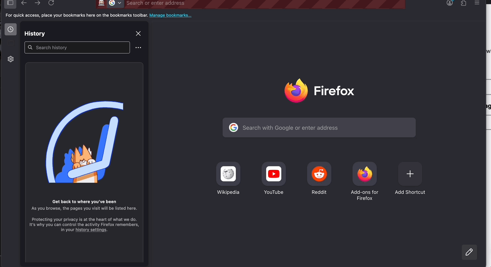
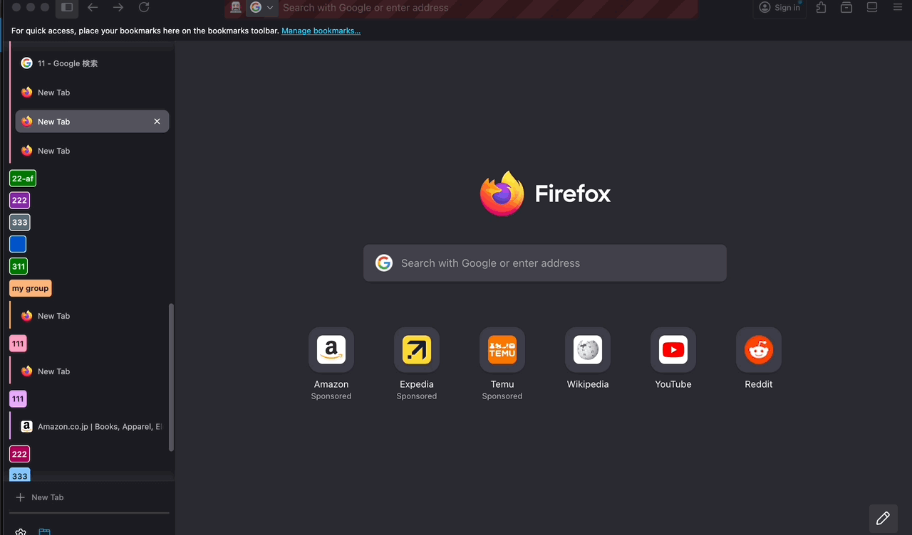
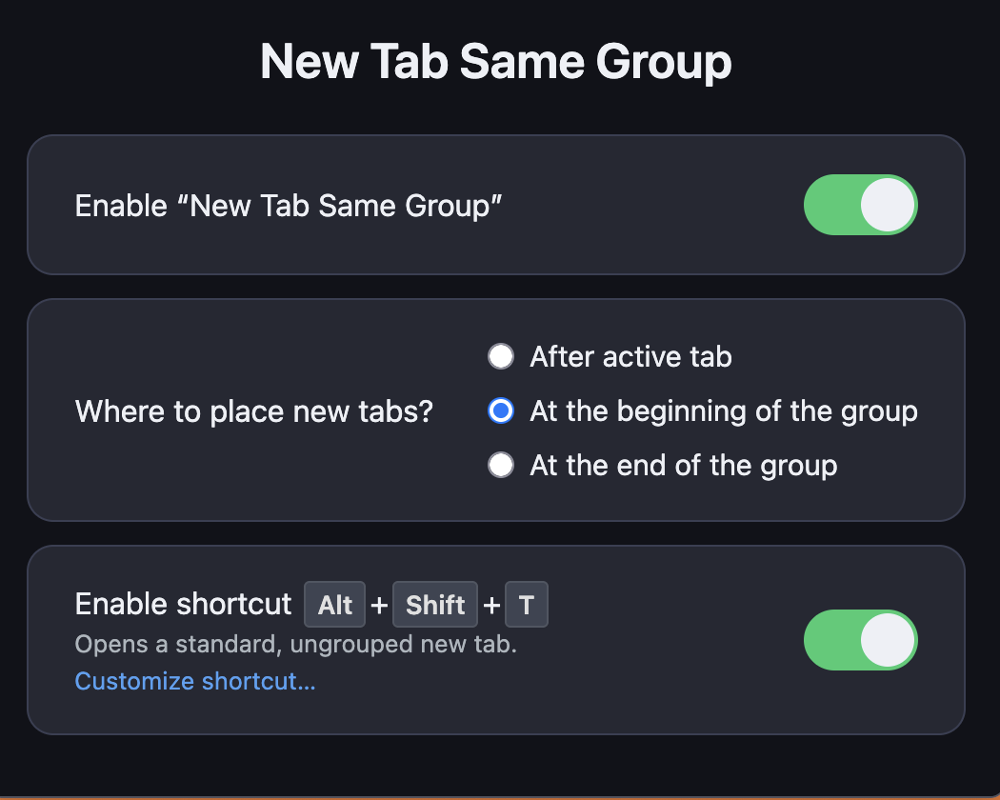
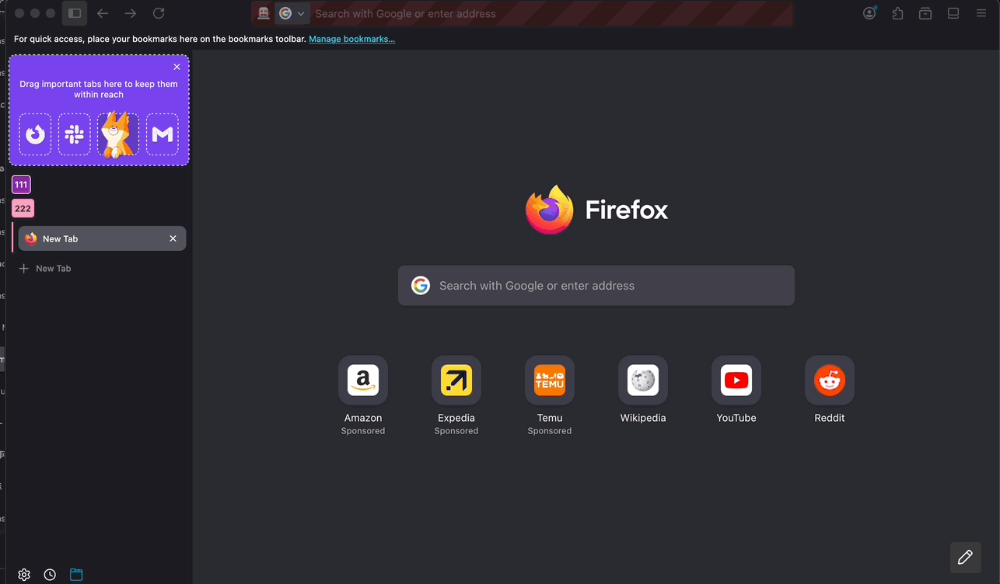
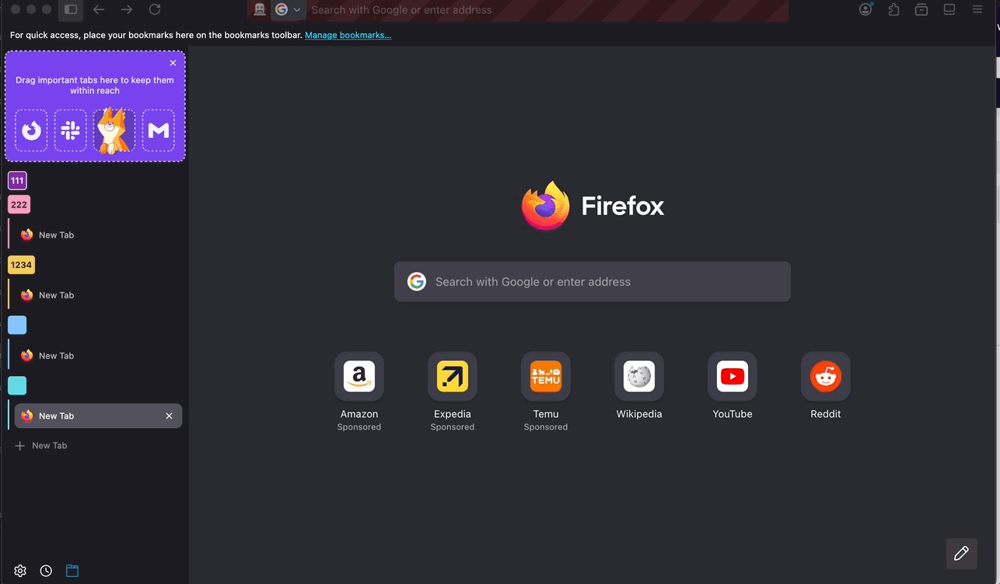

# New Tab Same Group Fix

**New Tab Same Group Fix** is a Firefox extension that improves tab organization and group management by automatically inserting new tabs into the same group as your current active tab — right after it, at the beginning, or at the end of the group, based on your preference.
This extension only works with **native tab grouping** as well as **[extension tab group API](https://developer.mozilla.org/en-US/docs/Mozilla/Add-ons/WebExtensions/API/tabGroups)** (Firefox 139+).

-- 

## thanks
- [new-tab-same-group](https://github.com/onlybets/firefox-addon-new-tab-same-group)
- firefox&MDN

---

## 🚀 Features

- Automatically groups new tabs with the active one
- Choose where new tabs are inserted:
  - **After active tab** (default)
  - **At the beginning** of the current group
  - **At the end** of the current group
- ⌨️ Optional keyboard shortcut (`Alt+Shift+T` by default) to open a new tab in the standard Firefox way, without applying grouping logic. This can be toggled in the extension's options.
- Introduce **[sidebar](#sidebar-pageworkflow)** for more convenient workflow creating a new group. There is an alternative way to create a new group by [shortcut `Alt+Shift+G`](#alternative-workflow)

---

## 📖 FAQ

1. The function "1 second delay with cancel" is an experienmental feature(actually it's developed by the last author), it would be removed it in the future.
2. Due to some of issues, unfortunately, my is not able to focus to input instantly after opened like the builtin sidebar e.g. **sidebar-history**

3. There is no `focus api` for both tab and tab group provided by MDN. Hence, i simulate focus handler by creating a tab and remove it on the last active index. It may cause tearing if group or tab is too much.

---

## 📸 Screenshots

### option page

*Screenshot of the options panel, including the new toggle for the standard tab shortcut.*

### sidebar page&workflow

#### create a group simply

*you are able to create a group with page `about:newtab` in a simplier way. And you can toggle it either click the button or typing `Alt+Command+S`*

#### create a group everywhere

### alternative workflow

*create group by shortcut(`Alt+Command+G`), but you should right click the untitled group to name it*

---

## 🛠 Requirements

- Firefox 139 or higher
- The browser’s native tab grouping system must be enabled

---

## ⚙️ How to Enable Tab Groups in Firefox

This extension works with both **classic horizontal tabs** and **vertical tabs in the sidebar**.

If you don’t see tab groups:

- Open the sidebar via `F9` or View → Sidebar → Tabs

---

## ⌨️ Keyboard Shortcut for Standard New Tab

You can enable a keyboard shortcut (`Alt+Shift+T` by default) in the extension's options to open a new tab that bypasses the extension's grouping logic. This is useful if you occasionally want a new tab to open with Firefox's default behavior.

You can customize this shortcut via Firefox's "Manage Extension Shortcuts" menu:

1. Go to `about:addons`.
2. Click the gear icon ⚙️ in the top-right corner.
3. Select "Manage Extension Shortcuts".
4. Find "New Tab Same Group" and customize the "Open a standard new tab (not managed by the extension)" shortcut.
   You can also open this settings page directly from the extension's options by clicking the **Customize shortcut…** link.

---

## 🧩 Installation

Download from [addons.mozilla.org](https://addons.mozilla.org/en-US/firefox/addon/new-tab-same-group-fix/) (Link will point to the latest version once published)

---

## 📝 License

MIT — see [`LICENSE.txt`](LICENSE.txt)
